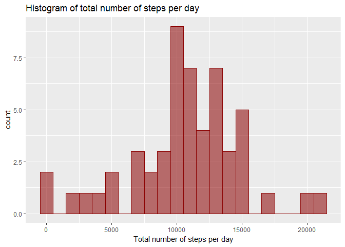
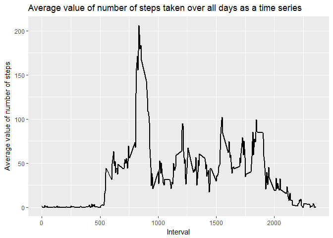
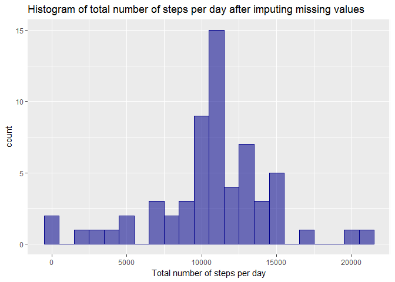
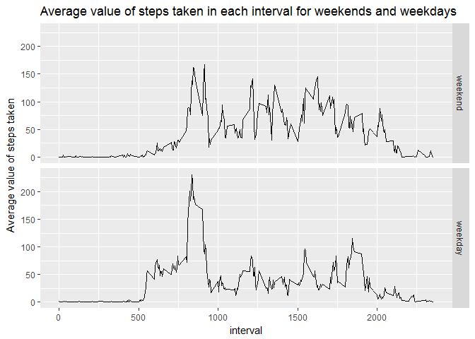

# Reproducible Research: Peer Assessment 1


## Loading and preprocessing the data
The first step is to read the data into R using read.csv() command.


```r
activity <- read.csv("C://Users/Abbas/Desktop/Github/course5_week2/RepData_PeerAssessment1/activity/activity.csv", header = TRUE)
```


## What is mean total number of steps taken per day?
For this question only a subset of data in which feature "steps" is not a missing value has been used. Then using tapply() function, total number of steps taken per day has been calculated. The histogram of total number of steps taken per day is shown below. 

```r
library(ggplot2)
```

```
## Warning: package 'ggplot2' was built under R version 3.3.2
```

```r
options(scipen = 999)
df <- subset(activity, !is.na(activity$steps))
total_steps <- tapply(df$steps, df$date, sum, na.rm = T)
qplot(total_steps, geom = "histogram",
      binwidth = 1000, 
      fill = I("darkred"), 
      alpha = 0.5, 
      col = I("darkred"), 
      xlab = "Total number of steps per day", 
      main = "Histogram of total number of steps per day") +
  theme(legend.position = "none")
```

```
## Warning: Removed 8 rows containing non-finite values (stat_bin).
```

<!-- -->

```r
mean <- mean(total_steps, na.rm = T)
median <- median(total_steps, na.rm = T)
```
The mean and median value of total number of steps taken per day is as follows:  
- **Mean** = 10766.19 steps    
- **Median** = 10765 steps 


## What is the average daily activity pattern?
In order to answer this question, we used feature "interval" and change  it to factor in order to be 
able to use tapply() function.


```r
avg_steps <- tapply(activity$steps, as.factor(activity$interval), mean, na.rm = T)
qplot(unique(activity$interval), avg_steps, 
      geom = "line",
      xlab = "Interval", 
      ylab = "Average value of number of steps", 
      main = "Average value of number of steps taken over all days as a time series") +
  geom_line(lwd = 1)
```

<!-- -->

```r
max_avg_step <- activity$interval[which.max(avg_steps)]
```
835th 5-minute interval has the highest avergae value of steps taken.


## Imputing missing values

```r
no_miss <- sum(is.na(activity$steps))
```
There are 2304 missing values in the dataset.  

In order to impute these missing values in the dataset, we replace each missing value by the average 
value of number of steps over all days in the corresponding interval.

```r
na_indices <- which(is.na(activity$steps))
activity[na_indices,1] <- sapply(na_indices, function(x){
          avg_steps[[as.character(activity$interval[x])]]
})
total_steps_new <- tapply(activity$steps, activity$date, sum)
qplot(total_steps_new, geom = "histogram",
      binwidth = 1000, 
      fill = I("darkblue"),
      col = I("darkblue"),
      alpha = 0.5, 
      xlab = "Total number of steps per day", 
      main = "Histogram of total number of steps per day after imputing missing values") +
  theme(legend.position = "none")
```

<!-- -->

```r
mean <- mean(total_steps_new)
median <- median(total_steps_new)
```
Mean and Median values of total number of steps taken per day after imputing the missing values are as follows:  
-**Mean** = 10766.19  
-**Median** = 10766.19  
Since the missing values were replaced by mean value of steps in their corresponding interval over all days, average value of number of steps has not changed.  


## Are there differences in activity patterns between weekdays and weekends?
For this step data set has been grouped to two groups of weekdays and weekends. 

```r
library(dplyr)
```

```
## Warning: package 'dplyr' was built under R version 3.3.2
```

```
## 
## Attaching package: 'dplyr'
```

```
## The following objects are masked from 'package:stats':
## 
##     filter, lag
```

```
## The following objects are masked from 'package:base':
## 
##     intersect, setdiff, setequal, union
```

```r
Wdays <- c("Monday", "Tuesday", "Wednesday", "Thursday", "Friday")
activity$day <- factor((weekdays(as.Date(activity$date, "%Y-%m-%d")) %in% Wdays),
                       levels = c(FALSE, TRUE), labels = c("weekend","weekday"))
activity <- mutate(activity, interval = as.factor(interval))
grpd_activity <- activity %>% 
  group_by(day, interval) %>%
  summarise(mean = mean(steps)) %>%
  mutate(interval = as.numeric(as.character(interval)))
ggplot(data = grpd_activity, 
       aes(interval, mean)) +
  geom_line()+
  facet_grid(day~.)+
  labs(y = "Average value of steps taken", 
       title = "Average value of steps taken in each interval for weekends and weekdays")
```

<!-- -->
